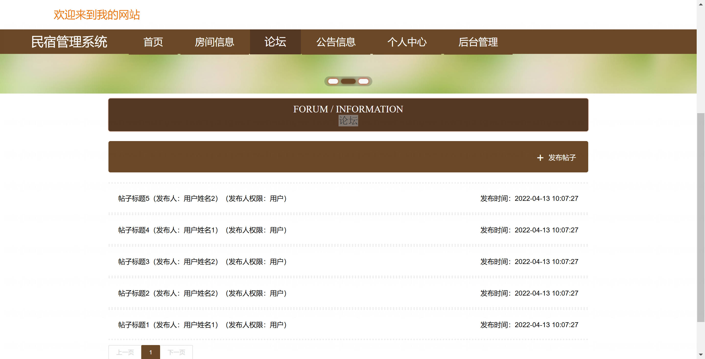

基于 Spring Boot 的民宿管理系统（程序+论文）
=

### 完整代码获取地址：从戎源码网 ([https://armycodes.com/](https://armycodes.com/))
### 作者微信：19941326836  QQ：952045282 
### 承接计算机毕业设计、Java毕业设计、Python毕业设计、深度学习、机器学习
### 选题+开题报告+任务书+程序定制+安装调试+论文+答辩ppt 一条龙服务
### 所有选题地址https://github.com/nature924/allProject

一、项目介绍
---

基于 Spring Boot + Vue 的民宿管理系统，提供后台管理与前台用户（住客）功能，角色分为 民宿管理员 / 普通用户（住客）。主要功能如下：

民宿管理员（中等管理权限）
基本操作：登录、修改密码、查看/修改个人信息
用户管理：用户列表、查看详情、新增/修改/删除用户、重置密码、权限分配
房间管理：房间列表、查看详情、新增/修改/删除房间、图片管理
订单管理：订单列表、查看详情、订单状态管理（完成/退款）、统计报表
评论/投诉管理：查看/处理房间留言/投诉
论坛/公告管理：帖子与公告的 CRUD 管
公告/论坛：发布/管理公告与帖子（视权限）

普通用户（住客 / 前端用户）
账号操作：注册、登录、退出、查看/修改个人信息
房间浏览：查看房间列表与详情、图片展示、筛选（按类型/价格等）
预约/下单：创建房间预约（订单）、查看订单、申请退款/评价
评论互动：对房间发表留言/投诉、查看论坛帖子与公告

二、项目技术
---
- 编程语言：Java
- 数据库：MySQL
- 项目管理工具：Maven
- 前端技术：VUE、HTML、Jquery、Bootstrap
- 后端技术：Spring、SpringMVC、MyBatis

三、运行环境
---
- 操作系统：Windows、macOS都可以
- JDK版本：JDK1.8以上都可以
- 开发工具：IDEA、Ecplise、Myecplise都可以
- 数据库: MySQL5.7以上都可以
- Tomcat：任意版本都可以
- Maven：任意版本都可以

四、运行截图
---
### 论文截图：

### 程序截图：

